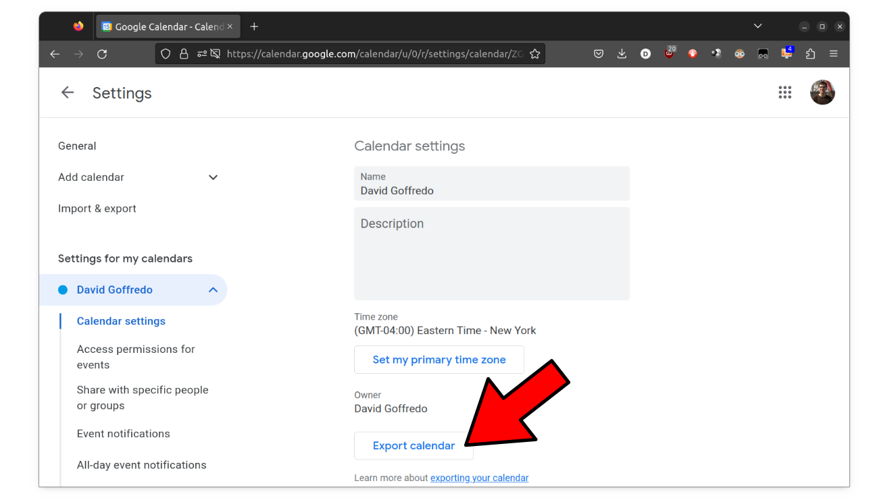

```console
$ pip install ics

$ python ics2sqlite.py --help
usage: ics2sqlite.py [-h] input_calendar output_database

Convert an exported Google Calendar into a sqlite3 database.

positional arguments:
  input_calendar   path to .ics calendar file
  output_database  path to sqlite3 database file

options:
  -h, --help       show this help message and exit

$ python ics2sqlite.py calendar.ics calendar.sqlite
Creating database tables in calendar.sqlite ...
Parsing calendar from calendar.ics ...
[...]
Done.

$ sqlite3 calendar.sqlite
sqlite> select key, name, begin_iso, duration_seconds from Meeting where week = '2023-W06';
[...]
```
